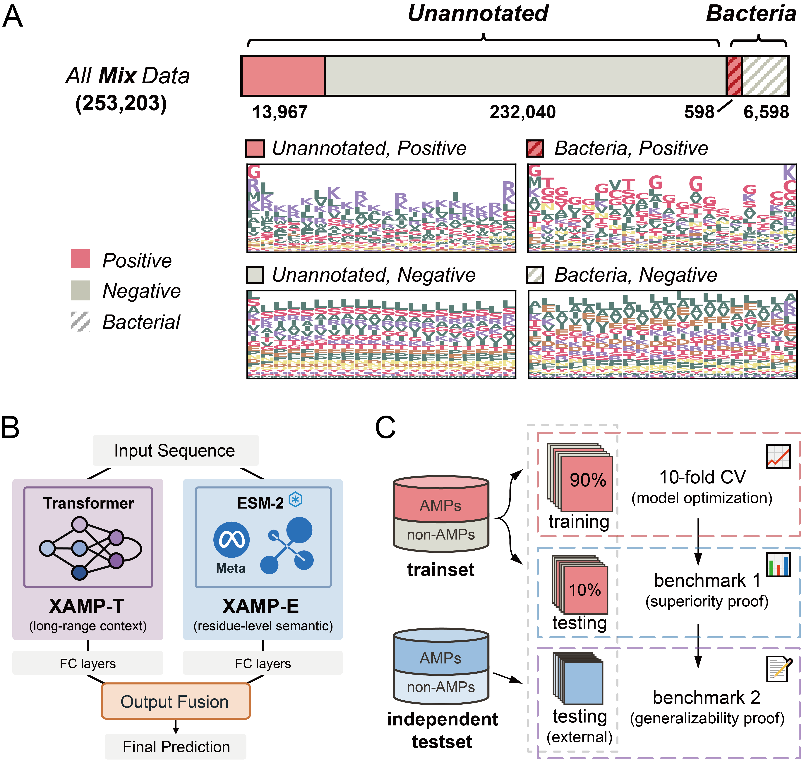
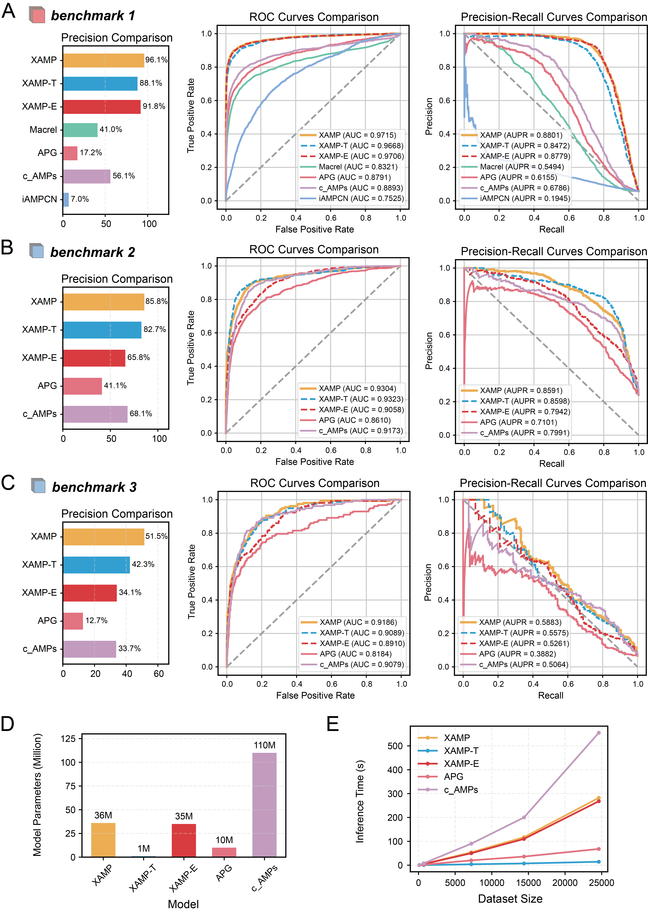

# XAMP: Dual-Engine Antimicrobial Peptide Prediction

This repository contains the source code for the paper **[XAMP: debiased dual-engine AI framework enables global discovery of antimicrobial peptides from deep-sea microbiomes](https://www.biorxiv.org/content/10.1101/2025.11.20.689422)**.

- [🌏 Overview](#---overview)
- [📊 Model Performance](#---model-performance)
- [📦 Installation](#---installation)
- [🔧 Usage](#---usage)
  * [1. Python API](#1-python-api)
  * [2. Command Line](#2-command-line)
- [📋 Output Format](#---output-format)
- [🧩 Features](#---features)
- [📚 Citation](#---citation)


## 🌏 Overview

The escalating global threat of multidrug-resistant pathogens underscores the urgent demand for innovative strategies in antimicrobial peptide (AMP) discovery. Notably, deep-sea-related data resources remain underexplored, despite their potential as valuable sources of novel AMPs. Current AMP prediction methods, however, are limited by dataset biases such as sequence length imbalance between AMPs and non-AMPs, N-terminal methionine artifacts in non-AMPs, and microbial origin specificity. To overcome these constraints, we developed **XAMP**—a **dual-engine predictor** which integrates two complementary architectures: XAMP-E, built on ESM-2 for high-accuracy feature representation, and XAMP-T, built on one-layer Transformer for accelerating large-scale screening. This dual-engine design ensures both robust feature learning and enhanced generalization capability. By constructing length-balanced datasets, removing N-terminal methionine from non-AMPs, and training microbial-specific variants , XAMP achieved a median area under the receiver-operating characteristic curve (AUC) of 0.972, representing an approximately 10% improvement over state-of-the-art predictors. 

<p align="center">
  
</p>

**Figure 1. Integrated framework for AMP prediction and analysis.**
- **(A)** Data composition and motif characterization showing distribution in the 'Mix' dataset
- **(B)** Dual-engine architecture integrating XAMP-T (Transformer-based) and XAMP-E (ESM-2 based)
- **(C)** Data partitioning strategy with 10-fold cross-validation


## 📊 Model Performance

| Model | Precision | AUC | AUPR | Speed | Use Case |
|-------|-----------|-----|------|-------|----------|
| XAMP-T | 88.1% | 0.9668 | 0.8472 | Fast | Large-scale screening |
| XAMP-E | 91.8% |0.9706 | 0.8779 | Accurate | High-confidence prediction |
| **XAMP (Integrated)** | **96.1%** | **0.9715** | **0.8801** | Balanced | **Recommended** |

<p align="center">
  
</p>

**Figure 2. Benchmarking results of XAMP.**
- **(A-C)** Superior predictive performance on testsets
- **(D)** Efficient model parameter counts
- **(E)** Fast inference speed across different dataset sizes

## 📦 Installation

```bash
# Using conda environment
conda env create -f XAMP.yaml
conda activate XAMP

# Install package in development mode to enable CLI
pip install -e .
```

## 🔧 Usage

### 1. Python API

```python
from XAMP import XAMP

# Initialize predictor (default: Mix dataset)
predictor = XAMP(
    model_type='integrated',  # 'integrated', 'xamp_t', or 'xamp_e'
    dataset='mix',            # 'mix' (default) or 'unknown'
    device='auto'             # 'auto', 'cpu', or 'cuda'
)

# Single sequence prediction
result = predictor.predict("LLGDFFRKSKEKIGKEFKRIVQRIKDFLRNLVPRTES")

# Batch prediction
sequences = [
    "LLGDFFRKSKEKIGKEFKRIVQRIKDFLRNLVPRTES",
    "ACDEFGHIKLMNPQRSTVWY",
    "MKGLGLGLGLGLGLGLGLGL"
]
results = predictor.predict(
    sequences, 
    batch_size=64, 
    remove_n_met=False,  # Do NOT trim N-terminal Met (default; matches paper benchmark)
    threshold=0.5        # Classification threshold
)

# Use Unknown-dataset models (for Benchmark 2 reproduction)
predictor_unknown = XAMP(model_type='integrated', dataset='unknown')

# Quick prediction function
from XAMP import predict_amp
result = predict_amp("LLGDFFRKSKEKIGKEFKRIVQRIKDFLRNLVPRTES")
```

### 2. Command Line
```bash
usage: xamp-predict [-h] [--input INPUT] [--output OUTPUT] 
                    [--model_type {integrated,xamp_t,xamp_e}]
                    [--dataset {mix,unknown}]
                    [--device {auto,cpu,cuda}] [--batch_size BATCH_SIZE]
                    [--threshold THRESHOLD] [--remove_n_met]

XAMP - Antimicrobial Peptide Prediction Tool

options:
  -h, --help            show this help message and exit
  --input INPUT, -i INPUT
                        Input file path (FASTA or text format).
  --output OUTPUT, -o OUTPUT
                        Output file path. If not provided, results will be printed to console.
  --model_type {integrated,xamp_t,xamp_e}
                        Model type to use for prediction (default: integrated)
  --dataset {mix,unknown}
                        Training dataset variant: "mix" for general prediction (default), "unknown" for Benchmark 2 reproduction
  --device {auto,cpu,cuda}
                        Device to run inference on (default: auto)
  --batch_size BATCH_SIZE
                        Batch size for prediction (default: 64)
  --threshold THRESHOLD
                        Probability threshold for classification (default: 0.5)
  --remove_n_met        Remove N-terminal methionine from sequences

Examples:
  xamp-predict --input test.fasta --output test.xamp_pred.tsv --remove_n_met
  xamp-predict --input sequences.txt --device cuda --batch_size 128
  xamp-predict --input benchmark2.fasta --dataset unknown
```

## 📋 Output Format

Returns DataFrame with:
- `seq`: Input sequence
- `seq_processed`: Input sequence (After N-terminal trimming, if enabled)
- `prob_xamp_t`: XAMP-T probability
- `prob_xamp_e`: XAMP-E probability  
- `proba_final`: Final probability
- `prediction`: Binary classification (1=AMP, 0=non-AMP)


## 🧩 Features

- **Dual-engine architecture** (ESM-2 + Transformer)
- **Debiased training** addressing dataset biases
- **Batch processing** for large datasets
- **Flexible model selection** based on needs
- **Gzip-compressed model auto-loading** — works directly with `.pth.gz` files from GitHub (no manual decompression needed)

## 📁 Pre-trained Models

Two model variants are provided, trained on different datasets:

| Dataset Variant | Model Files | Description |
|----------------|-------------|-------------|
| **Mix** (default) | `xamp_t.state_dict.pth.gz`, `xamp_e.state_dict.pth.gz` | Trained on the Mix dataset; recommended for general AMP prediction and Benchmark 1/3 reproduction |
| **Unknown** | `xamp_t.un.state_dict.pth.gz`, `xamp_e.un.state_dict.pth.gz` | Trained on the Unknown dataset; for Benchmark 2 reproduction |

Select the variant via the `dataset` parameter (`'mix'` or `'unknown'`) in Python API or `--dataset` flag in CLI.

## 📚 Citation

```bibtex
@article {Chen2025.11.20.689422,
	title = {A Global Discovery of Antimicrobial Peptides in Deep-Sea Microbiomes Driven by an ESM-2 and Transformer-based Dual-Engine Framework},
	author = {Chen, Bairun and Mou, Xinyi and Song, Zhuoxuan and Lin, Huaying and Zhang, Yu and Li, Jing},
	doi = {10.1101/2025.11.20.689422},
	journal = {bioRxiv},
	year = {2025}
}
```

**Issues**: https://github.com/Li-Lab-SJTU/XAMP/issues 
**Contact**: jing.li@sjtu.edu.cn
